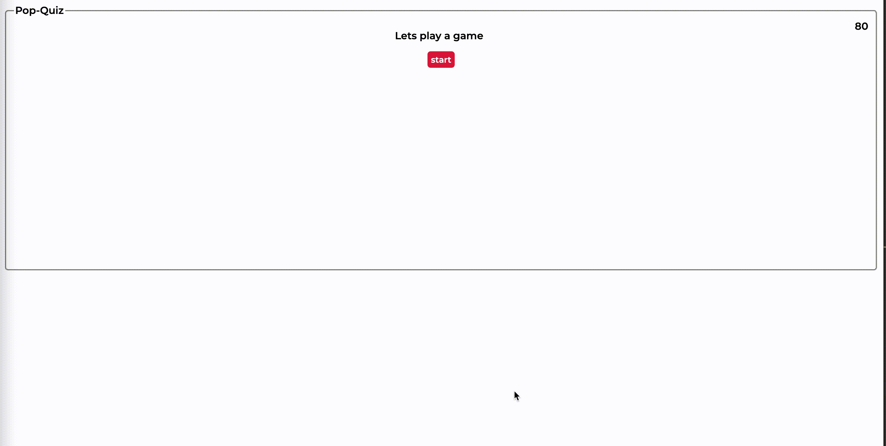

# pop-quiz


## Table of contents
* [General info](#general-info)
* [Sources](#sources)

## General info
Pop Quiz is a simple game that utilizes ```localStorage```, ```SetIntervals```, and ```arrays``` to keep track of **users**, **scores**, and **time**. There's only **5** questions with **80** seconds on the clock. If you cant answer all questions in time, the game will end and will display a score list where you must input your first and last intials to keep track and comapre your progress!

## Sources
W3schools. "Quiz". W3school. https://www.w3schools.com/quiztest/quiztest.asp?qtest=CSS

Adam. "Removing Children Elements Given An Index?". Stackoverflow, 2010, Web. https://stackoverflow.com/questions/3400135/removing-children-elements-given-an-index

MDN. "Storage.clear()". Mdn, , Web. https://developer.mozilla.org/en-US/docs/Web/API/Storage/clear

W3. "Location Reload() Method". W3, , Web. https://www.w3schools.com/jsref/met_loc_reload.asp
